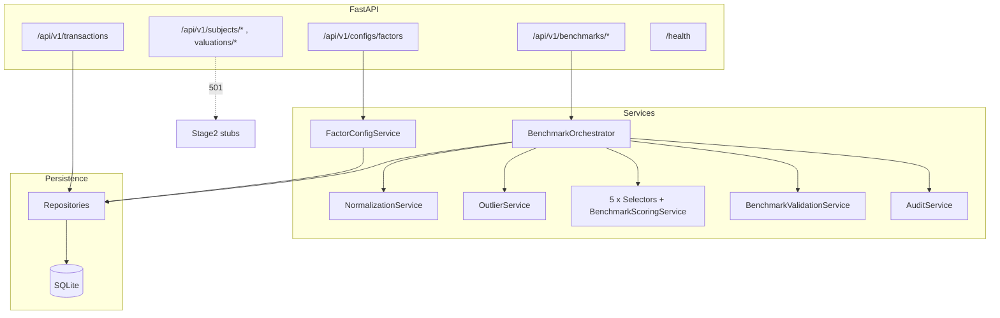

# Land Valuation System — Market Method

A production-oriented **land valuation** API built around the **Market Method**. The system is split into two conceptual stages:

1. **Stage 1 (implemented):** From a pool of historical land transactions, automatically select up to **five** benchmark parcels using five parallel selection rules, tiebreaker scoring, validation, and persistence.
2. **Stage 2 (designed, not executed via HTTP):** Comparable filtering, multi-factor scoring, and pricing math are **modeled in code** (`app/services/valuation/`, related models and repos). The Stage 2 REST endpoints return **501 Not Implemented** until wired to that logic.

---

## Table of contents

- [High-level architecture](#high-level-architecture)
- [Repository layout](#repository-layout)
- [Runtime and application lifecycle](#runtime-and-application-lifecycle)
- [Data layer](#data-layer)
- [Configuration](#configuration)
- [Stage 1: benchmark selection (detailed)](#stage-1-benchmark-selection-detailed)
- [Stage 2: valuation (design status)](#stage-2-valuation-design-status)
- [REST API](#rest-api)
- [Background scheduling](#background-scheduling)
- [Local run (without Docker)](#local-run-without-docker)
- [Pre-seeded data and regeneration](#pre-seeded-data-and-regeneration)
- [Testing](#testing)
- [Docker](#docker)

---

## High-level architecture

The stack is **async Python** with clear separation between HTTP, persistence, and domain logic.

| Layer | Role |
|--------|------|
| **FastAPI** (`app/main.py`, `app/api/`) | HTTP routing, dependency-injected DB sessions, OpenAPI docs |
| **Pydantic** (`app/schemas/`) | Request/response and config-facing shapes |
| **SQLAlchemy 2.0 async** (`app/models/`, `app/repositories/`) | Declarative models and repository-style data access |
| **SQLite + aiosqlite** | File-backed DB (`data/land_valuation.db`), suitable for local and container demos |
| **Pandas / NumPy** | Vectorized normalization, percentiles, outlier flags, and selector filters |
| **APScheduler** | In-process cron-style job to re-run benchmark selection |



**Design principles:** Routers stay thin; orchestration and rules live in `app/services/`; SQL is concentrated in `app/repositories/`. Settings are centralized in `app/core/config.py` and validated with Pydantic Settings (for example, tiebreaker weights must sum to 1.0).

---

## Repository layout

| Path | Purpose |
|------|---------|
| `app/main.py` | FastAPI app, router registration, lifespan (DB tables + scheduler) |
| `app/core/config.py` | Environment-driven `Settings` (thresholds, weights, cron, DB URL) |
| `app/core/database.py` | Async engine, `AsyncSessionLocal`, `get_db`, `Base`, `create_tables` |
| `app/core/exceptions.py` | HTTP exceptions (`NotFoundError`, `Stage2NotImplementedError`, etc.) |
| `app/core/logging_config.py` | Logging setup |
| `app/api/v1/routes/` | Routers: `transactions`, `benchmarks`, `configs`, `subjects`, `valuations` |
| `app/schemas/` | Pydantic models aligned with API and config responses |
| `app/models/` | SQLAlchemy `Mapped` / `mapped_column` table definitions |
| `app/repositories/` | Async queries and writes: transactions, benchmarks, subjects, valuations, factor config |
| `app/services/ingestion/` | `ImportService`, `NormalizationService`, `OutlierService` |
| `app/services/benchmark/` | Orchestrator, five selectors, `BenchmarkScoringService`, `BenchmarkValidationService` |
| `app/services/config/` | Location/zoning helpers if used; `FactorConfigService` for Stage 2 factor weights |
| `app/services/valuation/` | Stage 2 **design**: filter, factor scoring, pricing engine, `ValuationService` stub |
| `app/services/audit/` | `AuditService` — append-only audit rows after benchmark runs |
| `app/jobs/benchmark_refresh_job.py` | APScheduler factory attached to app lifespan |
| `data/` | SQLite DB, optional `mock_data.json`; see `data/README_data.md` |
| `scripts/generate_db.py` | Regenerate / seed database |
| `tests/unit/` | Pure logic tests (normalization, outliers, selectors, scoring, validation) |
| `tests/integration/` | Async API tests with isolated DB |

---

## Runtime and application lifecycle

1. **Startup** (`app/main.py` `lifespan`):
   - `create_tables()` ensures metadata exists (idempotent).
   - `create_scheduler(app)` starts **APScheduler** with the benchmark refresh job.
2. **Per request:** `get_db` yields an `AsyncSession`, commits on success, rolls back on exception.
3. **Shutdown:** Scheduler is shut down (`wait=False`).

**Health check:** `GET /health` returns JSON including database pointer, `stage1: active`, and a note that Stage 2 is not yet implemented at the API layer.

---

## Data layer

### Main tables (conceptual)

- **`land_transactions`** — Source comparables / history. Holds raw attributes plus derived fields updated by Stage 1 (`price_per_sqm`, `area_category`, `is_cleaned`, `is_outlier`, percentiles, city medians, etc.).
- **`benchmark_selection_runs`** — One row per run (`run_uuid`, status, counts, `filter_config_json`, `validation_result_json`, timestamps).
- **`benchmark_results`** — Up to five rows per run (one per benchmark type), nullable `land_transaction_id` when a slot finds no candidate.
- **`district_price_trends`** — Supports the **Emerging** selector (`trend_direction == "rising"` → district set).
- **`factor_configs`** — Ten weighted factors for Stage 2 (exposed read-only via `/api/v1/configs/factors`).
- **`audit_logs`** — Written after a successful benchmark run (entity `benchmark_run`).
- **Stage 2–oriented tables** (e.g. `subject_lands`, `valuation_runs`, `valuation_factor_scores`) exist in models for the designed flow; they are not driven by live valuation endpoints yet.

### Important domain flag: `is_cleaned`

In normalization, **`is_cleaned=True` means the row is excluded** from the benchmark pool (invalid price/area, wrong asset type, non-SAR currency, etc.). The **clean pool** for selectors is `is_cleaned == False` **and** `is_outlier == False`.

Repositories encapsulate access patterns (for example `LandTransactionRepository.get_all_for_processing`, bulk updates of cleaning fields, benchmark run listing).

---

## Configuration

Settings load from environment and optional `.env` (see `.env.example`).

| Category | Examples |
|----------|-----------|
| Core | `DATABASE_URL`, `APP_ENV`, `LOG_LEVEL` |
| Outliers | `OUTLIER_LOW_PCT`, `OUTLIER_HIGH_PCT` (default 5th / 95th on `price_per_sqm`) |
| Benchmark rules | `B1_*` … `B5_*` (percentile bands, zoning lists, IQR bounds, emerging lookback) |
| Tiebreaker | `SCORE_WEIGHT_*` (must sum to 1.0), `SCORE_RECENCY_DECAY_MONTHS` |
| Validation | `VALID_MIN_AREA_DIFF_PCT`, `VALID_MIN_PRICE_DIFF_PCT` |
| Scheduler | `BENCHMARK_REFRESH_CRON` (five-field cron string), `BENCHMARK_NEW_RECORD_THRESHOLD` (see [Background scheduling](#background-scheduling)) |

---

## Stage 1: benchmark selection (detailed)

The orchestrator **`run_benchmark_selection`** in `app/services/benchmark/benchmark_orchestrator.py` is the single entry point for the pipeline.

### Ordered steps

1. **Create run** — Insert `BenchmarkRun` with `status=running`, `trigger_type` (`manual` or `scheduled`).
2. **Load transactions** — All rows needed for processing via `LandTransactionRepository`.
3. **DataFrame materialization** — `ImportService.to_dict` + `pandas.DataFrame`.
4. **Normalize** — `NormalizationService.normalize`: land-only, valid price/area, SAR-only policy, `price_per_sqm`, `area_category` (bins on `area_sqm`), per-city `city_road_median` and `city_ppsqm_median`.
5. **Outliers** — `OutlierService.flag_outliers`: percentile thresholds, `price_percentile`, `price_band`, `is_outlier`.
6. **Persist derived fields** — `bulk_update_cleaning_fields` writes normalization/outlier outputs back to `land_transactions`.
7. **Clean pool** — In-memory filter: not cleaned, not outlier (used for counts and selectors).
8. **Rising districts** — Loaded from `DistrictPriceTrend` for the **Emerging** rule.
9. **Five selectors in parallel (conceptually)** — Each returns a dict or `None`:
   - **market_average** — Mid price percentile band, `Medium` area, road width vs `city_road_median` within tolerance.
   - **prime** — High percentile + prime zoning list.
   - **secondary** — Low price percentile (≤ `B3_PCT_MAX`) with **Small** / **Medium** area preference.
   - **large_dev** — IQR on area + development zoning list.
   - **emerging** — Recent window + percentile band + rising districts.
10. **Tiebreaking** — Within each selector, **`BenchmarkScoringService.score_candidates`** adds `tiebreaker_score` from weighted components: price stability vs city median, field completeness, centrality (lat/long vs district centroid when available), recency decay.
11. **Validation** — `BenchmarkValidationService.validate` produces `is_valid`, `benchmarks_found`, `flags`, `warnings` (e.g. low count, district overlap, area/price spread).
12. **Persist results** — One `BenchmarkResult` per benchmark type (nullable transaction id), update run to `completed` with JSON snapshots.
13. **Audit** — `AuditService.log` for the completed run.

On failure, the run is marked `failed`, `notes` store the error, and the exception propagates (transaction rollback handled by `get_db`).

---

## Stage 2: valuation (design status)

The following modules document and partially implement the **intended** Stage 2 pipeline (orchestration stub raises `NotImplementedError`):

- `app/services/valuation/valuation_service.py` — Planned orchestration (subject load, latest benchmarks, comparables, filter, score, price, persist).
- `app/services/valuation/comparable_filter_service.py`, `factor_scoring_service.py`, `pricing_engine.py` — Designed algorithms aligned with Market Method scoring and point-value math.

**HTTP surface today:**

- `GET/POST /api/v1/subjects*`, `POST/GET /api/v1/valuations/{subject_id}/*` → **`Stage2NotImplementedError` (501)** with a pointer to `app/services/valuation/`.

**Available for Stage 2 configuration:**

- `GET /api/v1/configs/factors` — Lists factor definitions and checks total weight (expected near 1.0).

---

## REST API

Base URL (local): `http://localhost:8000`  
Interactive docs: `http://localhost:8000/docs`

| Method | Path | Description |
|--------|------|-------------|
| `GET` | `/health` | Liveness metadata, stage flags |
| `GET` | `/api/v1/transactions` | Paginated list of land transactions |
| `GET` | `/api/v1/transactions/{id}` | Single transaction |
| `POST` | `/api/v1/benchmarks/run` | Run Stage 1 pipeline; **201** with full run payload |
| `GET` | `/api/v1/benchmarks/latest` | Latest **completed** run (404 if none) |
| `GET` | `/api/v1/benchmarks/runs` | Paginated run history |
| `GET` | `/api/v1/configs/factors` | Stage 2 factor weights (read-only) |
| `GET` / `POST` | `/api/v1/subjects`, `/api/v1/subjects/{id}` | **501** — not implemented |
| `POST` / `GET` | `/api/v1/valuations/{subject_id}/run`, `.../latest` | **501** — not implemented |

**Typical Stage 1 response shape:** run metadata, `filter_config` (thresholds used), `benchmarks` map with five keys (`market_average`, `prime`, `secondary`, `large_dev`, `emerging`) each either detailed benchmark info or `null`, plus `validation` (`flags` / `warnings`).

---

## Background scheduling

`app/jobs/benchmark_refresh_job.py` registers an **AsyncIOScheduler** cron job (default from `BENCHMARK_REFRESH_CRON`, e.g. `0 2 1 * *` — 02:00 on the 1st of each month). The job opens a new `AsyncSession`, runs `run_benchmark_selection` with `trigger_type="scheduled"`, and commits.

**Note:** `BENCHMARK_NEW_RECORD_THRESHOLD` is defined in settings for a possible future “re-run when enough new transactions exist” workflow; the **current** scheduler job does **not** consult it—only the cron trigger runs.

---

## Local run (without Docker)

**Prerequisites:** Python 3.9+ (Python 3.11 is used in the Dockerfile).

### 1. Create and activate a virtual environment
It is highly recommended to install dependencies inside an isolated virtual environment.
```bash
# Create the virtual environment
python3 -m venv .venv

# Activate (macOS/Linux)
source .venv/bin/activate

# Activate (Windows)
.venv\Scripts\activate
```

### 2. Install dependencies
```bash
pip install --upgrade pip
pip install -r requirements.txt
```

### 3. Start the server
```bash
uvicorn app.main:app --reload
```
The API will start at `http://localhost:8000`.
Navigate to **[http://localhost:8000/docs](http://localhost:8000/docs)** to use the interactive Swagger UI and test the API endpoints.

---

## Pre-seeded data and regeneration

- The repository includes a **pre-built** `data/land_valuation.db` so you can call the API immediately.
- `data/README_data.md` describes the mock dataset (transactions, districts, zoning, trends).
- Regenerate from scripts:

```bash
python scripts/generate_db.py
```

---

## Testing

```bash
pytest tests/ -v
```

- **`tests/unit/`** — Normalization, outliers, each selector, tiebreaker scoring, validation (mostly Pandas-level, no full app).
- **`tests/integration/`** — Async HTTP client against the app with isolated database setup (`pytest.ini` sets `asyncio_mode = auto`).

---

## Docker

```bash
docker build -t land-valuation-api .
docker run -d -p 8000:8000 --name land-valuation land-valuation-api
```

The image runs `uvicorn app.main:app` on port **8000**. Ensure the container image includes `data/land_valuation.db` (copied with `COPY . .` in the bundled `dockerfile`) or mount a volume with a seeded database if you customize the layout.


This README reflects the **current** codebase behavior. When Stage 2 endpoints are wired to `ValuationService` and related services, update the Stage 2 section and `/health` messaging to match.
